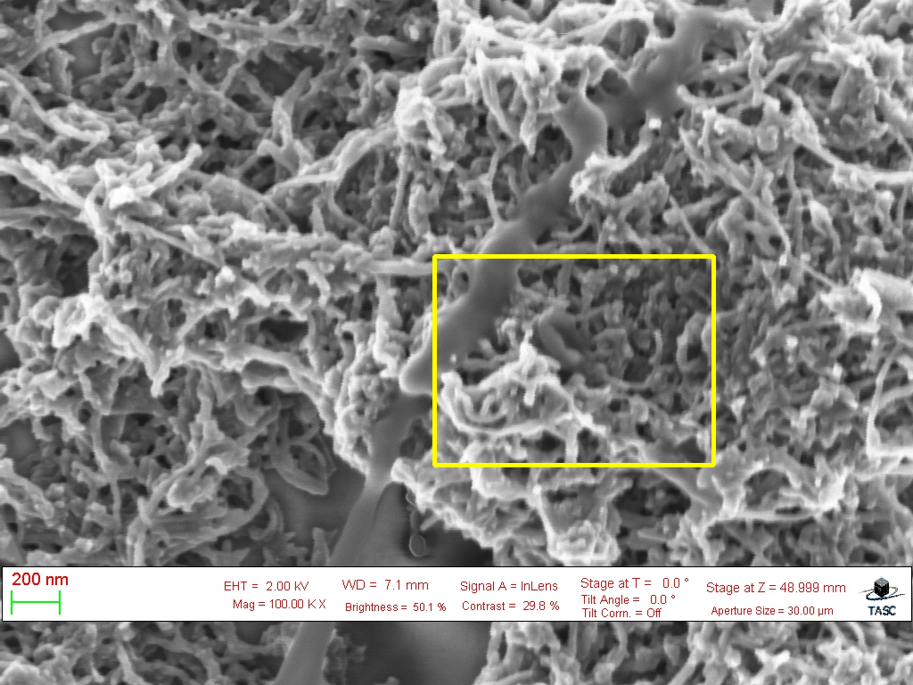
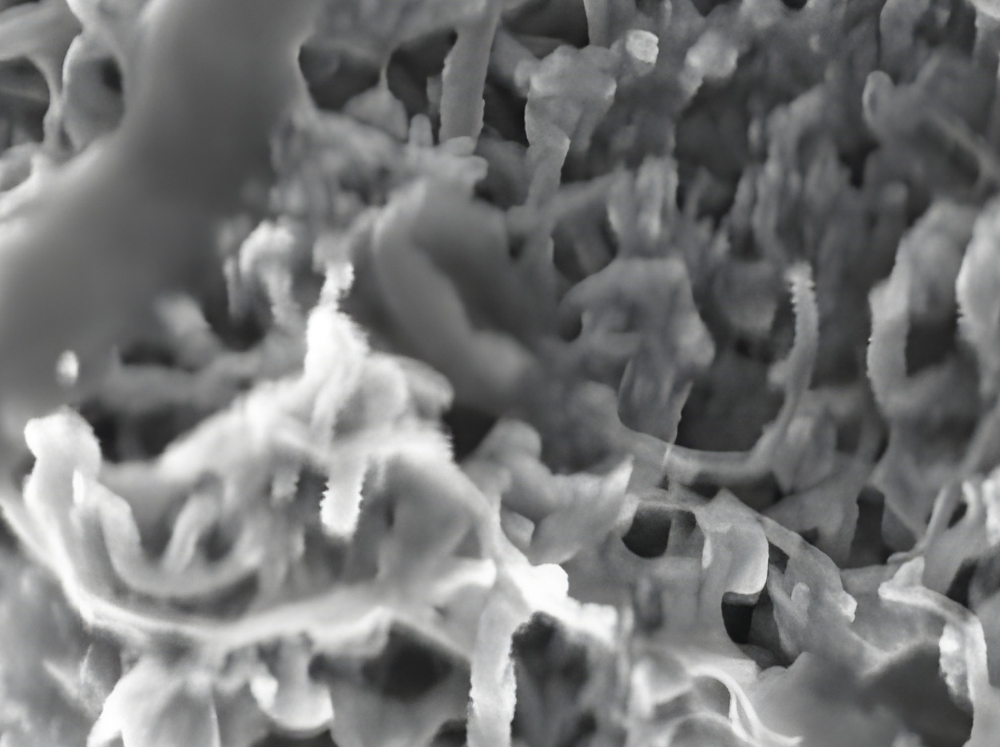
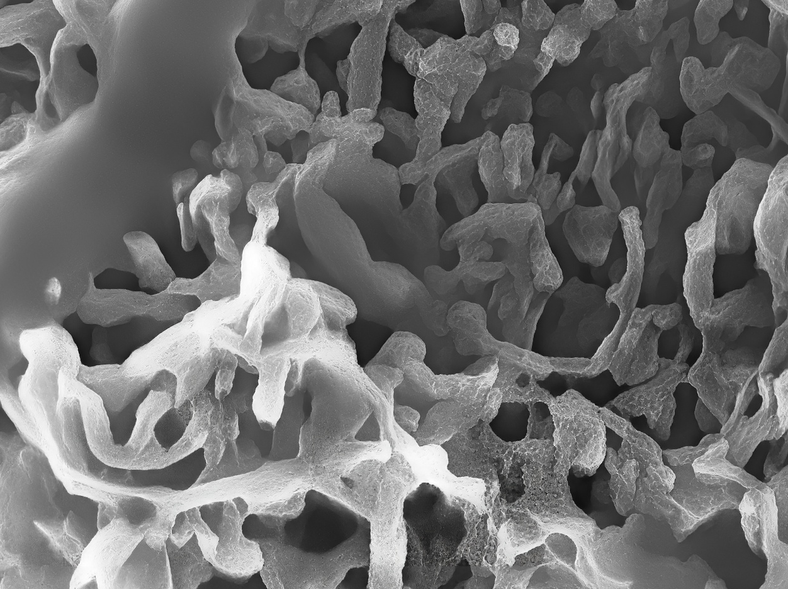
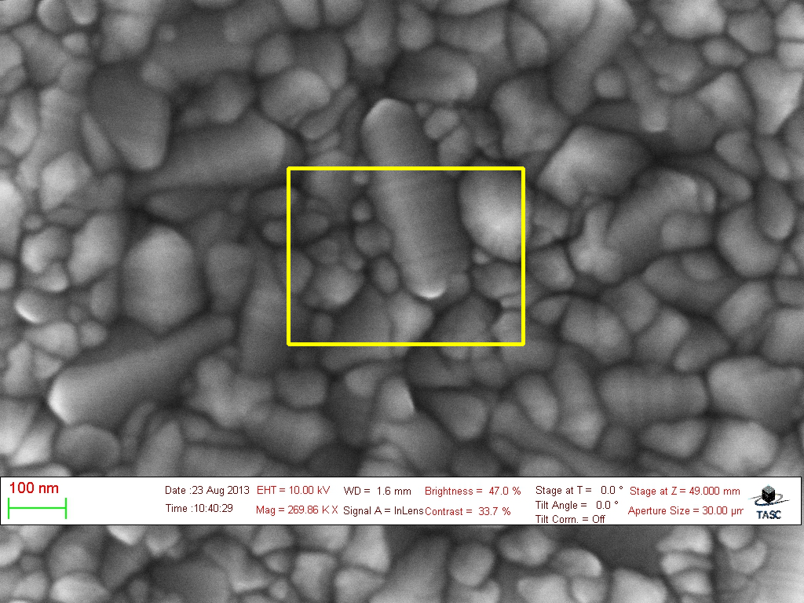

<div align="center">

# ExReal-ESRGAN

</div>


## Introduction

**ExReal-ESRGAN** (Extended Real-ESRGAN) is an extended version of [Real-ESRGAN](https://github.com/xinntao/Real-ESRGAN), optimized for **Scanning Electron Microscopy (SEM) images**.
ExReal-ESRGAN aims at enhancing SEM image quality with the following abilities:
- Denoise, sharpen and restore details more effectively.
- Preserve the characteristic microstructures of the specimen.

---

## Result Comparison

| Original image | Real-ESRGAN | **ExReal-ESRGAN** |
|--------------------------------------|--------------|-------------------|
|  |  |  |
|  |  |  |
|  |  |  |


---

## Installation

1. **Clone the repository**
   ```bash
   git clone https://github.com/nguyendotruong/ExReal-ESRGAN.git
   cd ExReal-ESRGAN
   ```

2. **Install dependencies**
   ```bash
   pip install -r requirements.txt -q
   python setup.py develop -q
   ```

### Important Notice about `basicsr`

This project includes a **modified version of [basicsr](https://github.com/xinntao/basicsr)** located in the repository (`./basicsr`).
Even though `basicsr` is **not explicitly listed** in `requirements.txt`, it will still be automatically installed as a dependency of other libraries.
Therefore, after installing the dependencies, you need to **uninstall the PyPI version** to make sure the project uses the customized local version:

```bash
pip uninstall basicsr -y
```

After uninstalling, Python will automatically use the customized `basicsr` inside this repository.

---

## Inference

By default, the model uses **ExReal-ESRGAN**.
This project provides **two models**:
- `ExReal-ESRGAN` (default, GAN-based)
- `ExReal-ESRNet` (non-GAN version, more stable, less artifacts)

You can specify them with the `-n` option. For example:

```bash
python inference_realesrgan.py -n ExReal-ESRGAN -i images
```

For more options, use the `-h` option for help:
```bash
python inference_realesrgan.py -h
```